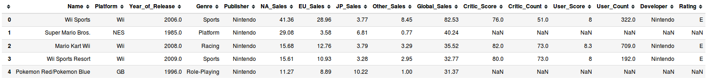
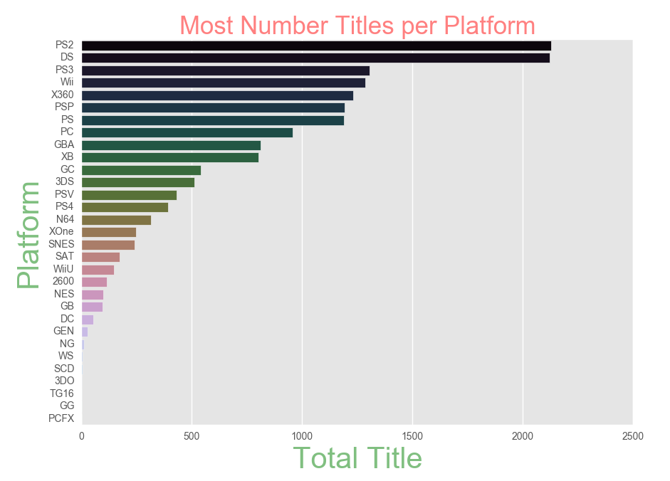
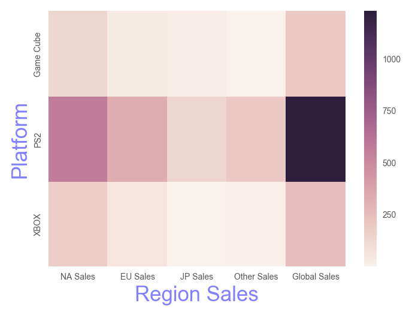

# Gamers don't die, they respawn

## Objective
This repo is about simple data analysis of video game titles, platforms and their sales in various parts of the world. By leveraging the wonderful python libraries for data analysis we gain deep insights into the data.

Some areas worth exploring:
* Titles which are available for more than one platform
* Top contending platform
* Which type of platform is popular?
* Top selling genres
* Top publishers by Global Sales

> Dataset can be downloaded from  [here](https://www.kaggle.com/rush4ratio/video-game-sales-with-ratings)

## Data Decription (as available on Kaggle)
### Context
Motivated by Gregory Smith's web scrape of VGChartz [Video Games Sales](https://www.kaggle.com/gregorut/datasets), this data set simply extends the number of variables with another web scrape from [Metacritic](http://www.metacritic.com/browse/games/release-date/available). Unfortunately, there are missing observations as Metacritic only covers a subset of the platforms. Also, a game may not have all the observations of the additional variables discussed below. Complete cases are ~ 6,900
### Content
Alongside the fields: Name, Platform, Year_of_Release, Genre, Publisher, NA_Sales, EU_Sales, JP_Sales, Other_Sales, Global_Sales, we have:-

* Critic_score - Aggregate score compiled by Metacritic staff
* Critic_count - The number of critics used in coming up with the Critic_score
* User_score - Score by Metacritic's subscribers
* User_count - Number of users who gave the user_score
* Developer - Party responsible for creating the game
* Rating - The [ESRB](https://www.esrb.org/) ratings

## Prerequiste
1. Python 3
2. Jupyter Notebook
3. Pandas (for data analysis)
4. Numpy
5. Matplotlib (for visualization)
6. Seaborn (for visualization)

### View the [Notebook](videogamesales.ipynb)

## How to run the Notebook
1. Download and install [Anaconda](https://anaconda.org). It contains all the relevant packages mentioned in Prerequiste section
2. Download the [dataset](https://www.kaggle.com/rush4ratio/video-game-sales-with-ratings) and this repository
3. Open terminal/command prompt and navigate to the downloaded repository, then run "jupyter notebook" command in the terminal
4. Jupyter file explorer will open in the browser. Click on the notebook then run Cell-->Run All from the menu.

### Data view

---
## Plots from notebook
### Most Number if Titles per Platform

---

## TODO
- [ ] Use predictive modelling to estimate future sales

